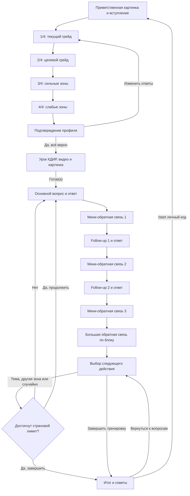

# Планируемый сценарий SA HR Bot

Этот файл описывает согласованную целевую логику бота. Квалификация, подтверждение, медиа, урок КДИР и трёхответный блок уже реализованы; контексты банка ещё должны пройти экспертную проверку. Исходный файл `Workflow-by-DanyaClaude.md` остаётся неизменным.

Источники сценария:

1. PDF `цепочка квал вопрос.pdf`.
2. Фидбэк Дани и заказчиков в `work-todo.md`.
3. Уточнения от 20 июля 2026 года. Они имеют приоритет, если PDF содержит ошибку или двусмысленность.

## Зафиксированные решения

- Вступление и четыре вопроса квалификации выполняются кодом без LLM.
- Вопрос 3 собирает сильные технические зоны. Вопрос 4 собирает слабые технические зоны. Повтор вопроса про слабые зоны в PDF является ошибкой.
- В квалификации доступны только грейды `Джун`, `Мидл` и `Сеньор`. Вариант `Лид` из PDF удаляется.
- Подтверждение профиля полностью заменяет прежний LLM-мини-аудит. Отдельного мини-аудита в новом сценарии нет.
- Перед вопросами кандидат получает короткий урок по формуле КДИР: Контекст, Действие, Инструмент, Результат.
- Один тематический блок состоит из основного вопроса и двух уточняющих вопросов.
- После каждого из трёх ответов бот сразу даёт короткую обратную связь по конкретному ответу.
- После короткой обратной связи на третий ответ бот даёт большую обратную связь по всему тематическому блоку.
- После заголовков `▸ ОБРАТНАЯ СВЯЗЬ` и `▸ БОЛЬШАЯ ОБРАТНАЯ СВЯЗЬ` всегда оставляется пустая строка перед содержимым рамки.
- После блока пользователь выбирает следующий вектор или завершает сессию отдельной кнопкой.
- Итог не стирает профиль и прогресс: после него можно вернуться к выбору следующей темы или явно начать новую тренировку через `/start код`.
- Вопросы, переходы и обратная связь звучат от лица интервьюера Кати.
- Тексты вступления, квалификации, подтверждения и урока КДИР берутся из PDF без содержательного пересказа. Единственная правка PDF: в вопросе 3 используется «лучше всего».
- `media/pic1.PNG` показывается в начале. `media/pic2.PNG` приходит вместе с подтверждением профиля. После подтверждения бот отправляет `media/vid1-kdir.mp4`, затем текст урока с кнопкой `Готов(а)`.
- Завершить тренировку можно только между полностью завершёнными тематическими блоками.
- `SESSION_CYCLE_LIMIT` остаётся страховочным порогом: при его достижении бот отдельно спрашивает, хочет ли пользователь продолжить.
- Свободный текст зон сопоставляется с пятью ключевыми категориями: интеграции, базы данных, архитектура, требования и безопасность.
- При исправлении анкеты кандидат проходит все четыре вопроса заново.
- Регистрация по одноразовым кодам остаётся без изменений.
- Контексты для CSV готовит разработчик, после чего их проверяет эксперт.
- Голосовые ответы не входят в ближайший MVP и переносятся в следующую версию.

## Регистрация

Существующая регистрация по одноразовому коду сохраняется без изменений. Зарегистрированный пользователь может начать новую сессию или продолжить активную.

## Фаза 0. Вступление

1. Бот отправляет `media/pic1.PNG` как приветственную картинку.
2. Бот отправляет фиксированный текст от лица Кати. Текст не генерируется моделью и одинаков для всех пользователей.
3. Вступление объясняет формат: четыре коротких вопроса, затем урок КДИР, после него тематические блоки из трёх вопросов с обратной связью.
4. После вступления бот сразу задаёт вопрос 1/4.

Утверждённый текст из PDF:

> Привет. Меня зовут Катя Желатинка, я собрала для тебя тренажёр для отработки технических собеседований системного аналитика.
>
> Это не чат-бот общего назначения. Под капотом этого ИИ-агента собраны 80 вопросов, которые задают на собесах в 2026 году.
>
> Формат простой: сначала 4 коротких вопроса про тебя, чтобы лучше понять твой запрос. Дальше цикл вопросов с разбором каждого ответа. Фидбек получаешь сразу, без ожидания.
>
> Представь, что готовишься к экзамену на права для авто, все тоже самое, только готовимся к собеседованию.
>
> Я буду задавать тебе основной вопрос и два дополнительных, а после буду давать обратную связь и разъяснение по твоим ответам.
>
> Прежде чем начнём – 4 вопроса, чтобы подобрать нужный уровень сложности. Начинаем?

## Фаза 1. Квалификация

Квалификация управляется кодом. Каждый ответ сразу сохраняется в PostgreSQL и переживает перезапуск процесса.

### Вопрос 1/4. Текущий грейд

Текст: `Какой у тебя текущий грейд?`

Кнопки:

- `Джун`
- `Мидл`
- `Сеньор`

### Вопрос 2/4. Целевой грейд

Текст: `На какой грейд собеседуешься?`

Кнопки:

- `Джун`
- `Мидл`
- `Сеньор`

### Вопрос 3/4. Сильные зоны

Текст:

```text
Какие технические зоны ты знаешь лучше всего?

Напиши ответ текстом:
- Интеграции
- Базы данных
- Архитектура
- Требования
- Безопасность

*выбери варианты и напиши мне их текстом*
```

### Вопрос 4/4. Слабые зоны

Текст:

```text
Какие технические зоны ты знаешь хуже всего?

Напиши ответ текстом:
- Интеграции
- Базы данных
- Архитектура
- Требования
- Безопасность

*выбери варианты и напиши мне их текстом*
```

### Подтверждение профиля

После четвёртого ответа бот не вызывает мини-аудит. Он показывает сохранённые данные:

```text
Зафиксировала твои ответы, правильно ли я понимаю, что...

Текущий грейд: {current_grade}
Целевой грейд: {target_grade}
Сильные зоны: {strong_zones}

Получается, в первую очередь будем подтягивать {weak_zones} для того, чтобы получить долгожданный оффер.
Всё верно?
```

Кнопки:

- `Да, все верно.`
- `Изменить ответы`

`Да, все верно.` сохраняет подтверждение и переводит сессию к уроку КДИР. Повторное нажатие не должно повторно отправлять весь урок или создавать вопросный блок.

`Изменить ответы` очищает ещё не подтверждённый профиль и возвращает пользователя к вопросу 1/4. Кандидат проходит все четыре вопроса заново.

## Фаза 2. Урок КДИР

После подтверждения профиля бот отправляет утверждённый фиксированный текст из PDF:

> Отлично, прежде чем начнём отработку - один короткий урок.
>
> Разбираю в нём формулу КДИР: Контекст, Действие, Инструмент, Результат.
>
> Это формула и способ, который позволит отвечать на технические вопросы так, чтобы сразу был виден масштаб задачи, что сделал именно ты, каким инструментом и какой результат получил.
>
> Без формулы ответ звучит как пересказ обязанностей. Сыро и иногда запутанно. А с ней, как конкретный кейс с цифрами, который интервьюер может корректно оценить.
>
> Смотри урок, переходи к тренажеру, а дальше на каждом вопросе тренажёра жду от тебя ответ именно по этой структуре.
>
> Посмотри видео, потом жми «Готов(а)».

После подтверждения профиля бот отправляет видео `media/vid1-kdir.mp4`, затем текст урока с кнопкой `Готов(а)`. Утверждённый текст служит пояснением к ролику; отдельной подписи у видео пока нет. До нажатия кнопки вопросный блок не начинается.

## Как профиль связывается с банком вопросов

Текст сильных и слабых зон сохраняется целиком для подтверждения и будущей обратной связи. Для выбора темы код выполняет регистронезависимый поиск ключевых слов:

- `Интеграции` → тема `интеграции`;
- `Базы данных` → тема `бд`;
- `Архитектура` → тема `архитектура`;
- `Требования` → тема `требования`;
- `Безопасность` → тема `безопасность`.

Если указано несколько слабых зон, они становятся приоритетной очередью тем. Если ни одно ключевое слово не найдено, бот не выдумывает классификацию и начинает со случайной подходящей темы.

В активном файле `question_bank.csv` находится 80 вопросов заказчика по пяти утверждённым темам. Формулировки и состав этого банка сохраняются в переданном виде, включая вопросы на soft skills. При синхронизации строки из прежних версий банка, которых нет в активном CSV, остаются в PostgreSQL для истории, но помечаются неактивными и больше не выдаются новым сессиям.

## Фаза 3. Тематический блок из трёх вопросов

Основной вопрос, `followup_1` и `followup_2` берутся из одной строки банка. Основной вопрос одной сессии не должен повторяться.

### Шаг 1. Основной вопрос

Бот говорит от лица Кати. Сообщение включает:

1. Короткое живое вступление.
2. Заранее подготовленный контекст из CSV.
3. Сам вопрос из банка.
4. Напоминание ответить текстом по КДИР.

Для быстрого визуального распознавания сам вопрос выделяется жирным. Вступление, контекст и напоминание остаются обычным текстом.

### Шаг 2. Ответ на основной вопрос

Кандидат отвечает. Интервьюер сразу даёт короткую обратную связь только по этому ответу: что раскрыто, чего не хватает и насколько ответ соответствует вопросу.

После мини-обратной связи Катя задаёт `followup_1` с понятным контекстом.

### Шаг 3. Ответ на первое уточнение

Кандидат отвечает. Интервьюер сразу даёт короткую обратную связь по второму ответу.

После мини-обратной связи Катя задаёт `followup_2` с понятным контекстом.

### Шаг 4. Ответ на второе уточнение

Кандидат отвечает. Интервьюер сначала даёт короткую обратную связь по третьему ответу.

Сразу после неё интервьюер даёт большую обратную связь по всему блоку:

- корректность ответов по теме;
- сильные стороны всех трёх ответов;
- фактические пробелы и ошибки;
- разбор подачи по КДИР;
- пример того, как можно было ответить сильнее;
- обновлённая карта слабых зон.

Тематический блок считается завершённым только после сохранения и успешной отправки мини-обратной связи на третий ответ и большой обратной связи по блоку.

### Шаг 5. Выбор следующего действия

Катя отправляет отдельное сообщение:

```text
Итак, мы потренировались в теме «{topic}». У меня ещё много вопросов. Куда идём дальше?
```

Кнопки:

- `Углубиться в тему`
- `Другая слабая зона`
- `Случайная тема`
- `Завершить тренировку`

Первые три кнопки начинают новый тематический блок. Кнопка завершения переводит сессию к итоговой обратной связи, но не удаляет профиль и накопленный прогресс.

Кнопка завершения показывается только после всех трёх вопросов, трёх мини-обратных связей и большой обратной связи. Команда `/finish` посередине блока для MVP не добавляется.

`SESSION_CYCLE_LIMIT` остаётся страховочным порогом. После достижения порога бот не завершает сессию молча, а спрашивает: `Хочешь продолжить тренировку?` и показывает кнопки `Продолжить` и `Завершить тренировку`. При продолжении начинается новый блок и следующий такой контроль выполняется ещё через установленное число полных блоков.

## Фаза 4. Итог и продолжение

По кнопке завершения между тематическими блоками бот строит итог только из сохранённых ответов и обратной связи. Сессия остаётся активной в состоянии итога, поэтому данные пользователя и накопленный прогресс не сбрасываются.

Итог должен включать:

- пройденные темы;
- подтверждённые сильные стороны;
- открытые слабые зоны;
- наблюдения по КДИР;
- конкретные рекомендации для следующей тренировки.

В MVP используется этот базовый состав без отдельной числовой шкалы и жёсткого шаблона длины. Эксперименты со структурой, шкалой и объёмом большой обратной связи и итогового отчёта переносятся в следующую релизную версию.

В конце итога бот пишет: `Если хочешь начать с самого начала, отправь /start {личный_код}` и показывает кнопку `Вернуться к вопросам`. Кнопка возвращает к выбору направления следующего блока на основании уже сохранённой карты. Сохранённый итог при этом удаляется как устаревший и будет заново сформирован после следующих блоков.

Команда `/start {личный_код}` явно начинает тренировку заново: текущая сессия сохраняется в истории как брошенная, а новая начинается с четырёх вопросов квалификации. Обычная команда `/start` при активной сессии по-прежнему предлагает продолжить её или начать заново.

Если подходящие вопросы закончились, бот объясняет это и автоматически предлагает завершить тренировку с итогом.

## Роли и использование LLM

Код без LLM отвечает за:

- вступление;
- четыре вопроса квалификации;
- подтверждение профиля;
- урок КДИР и медиа;
- выбор и отправку вопросов из банка;
- кнопки и переходы FSM.

LLM отвечает за:

- три короткие обратные связи внутри блока;
- большую обратную связь по тематическому блоку;
- структурированное обновление карты зон;
- итог сессии.

Вопросы не переписываются моделью во время интервью. Живое вступление и контекст заранее сохраняются в CSV, чтобы не тратить токены заново для каждого пользователя. Первую версию контекстов для всех строк готовит разработчик, затем заказчик передаёт их профильному эксперту на проверку.

## Планируемая карта состояний



## Данные, которые должны переживать перезапуск

- текущий и целевой грейд;
- сильные и слабые зоны;
- текущий шаг квалификации и факт подтверждения;
- факт показа урока и ожидание кнопки `Готов(а)`;
- выбранная тема и основной вопрос;
- три ответа;
- три мини-обратные связи;
- большая обратная связь;
- выбранный следующий вектор;
- итоговый текст.
- статистика токенов каждого вызова LLM с привязкой к пользователю и сессии.

Для каждого уже сгенерированного LLM-текста нужен статус «готов к отправке». Ошибка Telegram не должна вызывать повторную генерацию или перескакивать через шаг.

## Администрирование

Администраторы задаются списком Telegram ID в `ADMIN_IDS`. Команды `/code`, `/delete_code`, `/tokens` и `/report` недоступны всем остальным пользователям. Коды, пользователи, сессии и токены хранятся в одной PostgreSQL. Использованный код удалить нельзя, поскольку он является связью с профилем и историей тренировок.

## Отложено на следующие этапы

- Получение финального видео, подписи к нему и выбор способа хранения медиа в production.
- Настройка точной структуры, шкалы и длины большой обратной связи и итогового отчёта.
- Распознавание голосовых ответов.
- Экспертная проверка контекстов, которые разработчик добавит в CSV.
