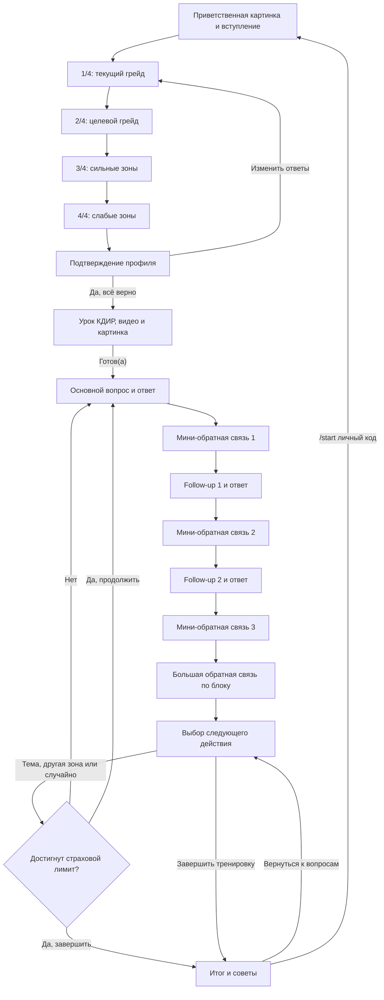

# Планируемый сценарий SA HR Bot

Этот файл описывает согласованную целевую логику бота. Квалификация, подтверждение, медиа, урок КДИР и трёхответный блок реализованы. С 5 сентября 2026 года активный банк заменён таблицей Кати, а обратная связь настроена как разговор с живым интервьюером и наставником. Исходный файл `Workflow-by-DanyaClaude.md` остаётся неизменным.

Источники сценария:

1. PDF `цепочка квал вопрос.pdf`.
2. Фидбэк Дани и заказчиков в `work-todo.md`.
3. Уточнения от 20 июля 2026 года. Они имеют приоритет, если PDF содержит ошибку или двусмысленность.
4. Таблица Кати «Мок-вопросы с ответами» и её ответы на уточнения от 5 сентября 2026 года.

## Зафиксированные решения

- Вступление и четыре вопроса квалификации выполняются кодом без LLM.
- Вопрос 3 собирает сильные технические зоны. Вопрос 4 собирает слабые технические зоны. Повтор вопроса про слабые зоны в PDF является ошибкой.
- Для текущего грейда доступны `Джун`, `Мидл` и `Сеньор`. Для целевого грейда доступны только `Мидл` и `Сеньор`. Варианты `Джун` и `Лид` не являются целевыми уровнями тренировки.
- Подтверждение профиля полностью заменяет прежний LLM-мини-аудит. Отдельного мини-аудита в новом сценарии нет.
- Перед вопросами кандидат получает короткий урок по формуле КДИР: Контекст, Действие, Инструмент, Результат. Формула является рекомендацией по подаче, а не условием правильности ответа.
- Один тематический блок состоит из основного вопроса и двух уточняющих вопросов.
- После каждого из трёх ответов бот сразу даёт короткую обратную связь по конкретному ответу.
- После короткой обратной связи на третий ответ бот даёт большую обратную связь по всему тематическому блоку.
- После заголовков `▸ ОБРАТНАЯ СВЯЗЬ` и `▸ БОЛЬШАЯ ОБРАТНАЯ СВЯЗЬ` всегда оставляется пустая строка перед содержимым рамки.
- После блока пользователь выбирает следующий вектор или завершает сессию отдельной кнопкой.
- Итог не стирает профиль и прогресс: после него можно вернуться к выбору следующей темы или явно начать новую тренировку через `/start код`.
- Вопросы, переходы и обратная связь звучат от лица интервьюера Кати.
- Тексты вступления, квалификации и подтверждения основаны на PDF. В вопросе 3 используется «лучше всего». Текст урока КДИР смягчён после фидбека Кати: формула предлагается как подсказка, а не обязательный шаблон.
- `media/pic1.PNG` показывается в начале. `media/pic2.PNG` приходит вместе с подтверждением профиля. После подтверждения бот отправляет `media/vid1-kdir.mp4`, затем текст урока с кнопкой `Готов(а)`.
- Завершить тренировку можно только между полностью завершёнными тематическими блоками.
- `SESSION_CYCLE_LIMIT` остаётся страховочным порогом: при его достижении бот отдельно спрашивает, хочет ли пользователь продолжить.
- Свободный текст зон сопоставляется с пятью ключевыми категориями: интеграции, базы данных, архитектура, требования и безопасность.
- При исправлении анкеты кандидат проходит все четыре вопроса заново.
- Регистрация по одноразовым кодам остаётся без изменений.
- Контексты для CSV готовит разработчик, после чего их проверяет эксперт.
- Голосовые ответы не входят в ближайший MVP и переносятся в следующую версию.

## Регистрация

Существующая регистрация по одноразовому коду сохраняется без изменений. Зарегистрированный пользователь может начать новую сессию или продолжить активную.

## Фаза 0. Вступление

1. Бот отправляет `media/pic1.PNG` как приветственную картинку.
2. Бот отправляет фиксированный текст от лица Кати. Текст не генерируется моделью и одинаков для всех пользователей.
3. Вступление объясняет формат: четыре коротких вопроса, затем урок КДИР, после него тематические блоки из трёх вопросов с обратной связью.
4. После вступления бот сразу задаёт вопрос 1/4.

Утверждённый текст из PDF:

> Привет. Меня зовут Катя Желатинка, я собрала для тебя тренажёр для отработки технических собеседований системного аналитика.
>
> Это не чат-бот общего назначения. Под капотом этого ИИ-агента собраны 58 вопросов, которые задают на собесах в 2026 году.
>
> Формат простой: сначала 4 коротких вопроса про тебя, чтобы лучше понять твой запрос. Дальше цикл вопросов с разбором каждого ответа. Фидбек получаешь сразу, без ожидания.
>
> Представь, что готовишься к экзамену на права для авто, все тоже самое, только готовимся к собеседованию.
>
> Я буду задавать тебе основной вопрос и два дополнительных, а после буду давать обратную связь и разъяснение по твоим ответам.
>
> Прежде чем начнём – 4 вопроса, чтобы подобрать нужный уровень сложности. Начинаем?

## Фаза 1. Квалификация

Квалификация управляется кодом. Каждый ответ сразу сохраняется в PostgreSQL и переживает перезапуск процесса.

### Вопрос 1/4. Текущий грейд

Текст: `Какой у тебя текущий грейд?`

Кнопки:

- `Джун`
- `Мидл`
- `Сеньор`

### Вопрос 2/4. Целевой грейд

Текст: `На какой грейд собеседуешься?`

Кнопки:

- `Мидл`
- `Сеньор`

### Вопрос 3/4. Сильные зоны

Текст:

```text
Какие технические зоны ты знаешь лучше всего?

Напиши ответ текстом:
- Интеграции
- Базы данных
- Архитектура
- Требования
- Безопасность

*выбери варианты и напиши мне их текстом*
```

### Вопрос 4/4. Слабые зоны

Текст:

```text
Какие технические зоны ты знаешь хуже всего?

Напиши ответ текстом:
- Интеграции
- Базы данных
- Архитектура
- Требования
- Безопасность

*выбери варианты и напиши мне их текстом*
```

### Подтверждение профиля

После четвёртого ответа бот не вызывает мини-аудит. Он показывает сохранённые данные:

```text
Зафиксировала твои ответы, правильно ли я понимаю, что...

Текущий грейд: {current_grade}
Целевой грейд: {target_grade}
Сильные зоны: {strong_zones}

Получается, в первую очередь будем подтягивать {weak_zones} для того, чтобы получить долгожданный оффер.
Всё верно?
```

Кнопки:

- `Да, все верно.`
- `Изменить ответы`

`Да, все верно.` сохраняет подтверждение и переводит сессию к уроку КДИР. Повторное нажатие не должно повторно отправлять весь урок или создавать вопросный блок.

`Изменить ответы` очищает ещё не подтверждённый профиль и возвращает пользователя к вопросу 1/4. Кандидат проходит все четыре вопроса заново.

## Фаза 2. Урок КДИР

После подтверждения профиля бот отправляет обновлённый фиксированный текст:

> Отлично, прежде чем начнём отработку - один короткий урок.
>
> Разбираю в нём формулу КДИР: Контекст, Действие, Инструмент, Результат.
>
> Это удобная подсказка для структуры ответа. Она помогает показать масштаб задачи, твои действия, использованные инструменты и результат.
>
> Не обязательно укладывать каждый ответ в КДИР дословно. Если ответ по смыслу верный и аргументированный, я это учту. Если структуры будет не хватать, я коротко напомню про формулу.
>
> Посмотри урок и попробуй использовать КДИР там, где она помогает яснее донести мысль.
>
> Посмотри видео, потом жми «Готов(а)».

После подтверждения профиля бот отправляет видео `media/vid1-kdir.mp4`, затем текст урока с кнопкой `Готов(а)`. Текст служит пояснением к ролику; отдельной подписи у видео пока нет. До нажатия кнопки вопросный блок не начинается.

## Как профиль связывается с банком вопросов

Текст сильных и слабых зон сохраняется целиком для подтверждения и будущей обратной связи. Для выбора темы код выполняет регистронезависимый поиск ключевых слов:

- `Интеграции` → тема `интеграции`;
- `Базы данных` → тема `бд`;
- `Архитектура` → тема `архитектура`;
- `Требования` → тема `требования`;
- `Безопасность` → тема `безопасность`.

Если указано несколько слабых зон, они становятся приоритетной очередью тем. Если ни одно ключевое слово не найдено, бот не выдумывает классификацию и начинает со случайной подходящей темы.

В активном файле `question_bank.csv` находится 58 основных вопросов из таблицы Кати. Они распределены по шести внутренним темам: архитектура, интеграции, базы данных, требования, безопасность и `soft-skills`. Техническая самооценка по-прежнему использует пять прежних категорий; `soft-skills` доступны при случайном выборе и при углублении в уже выпавшую тему.

Все вопросы имеют общий технический уровень `мидл-сеньор` и доступны обоим целевым грейдам. Разница ожиданий задаётся мета-промптом: для мидла достаточно верной сути и понятного применения, для сеньора дополнительно оцениваются уместные риски, компромиссы и альтернативы. Из трёх дожимов исходной таблицы используются первые два. Третий сохраняется только в исходном XLSX.

Ответы Кати хранятся как примеры хорошего ответа к основному вопросу и двум выбранным дожимам. Они не считаются единственно правильными вариантами. При синхронизации строки прежних банков остаются в PostgreSQL для истории, но помечаются неактивными и больше не выдаются новым сессиям.

## Фаза 3. Тематический блок из трёх вопросов

Основной вопрос, `followup_1` и `followup_2` берутся из одной строки банка. Основной вопрос одной сессии не должен повторяться.

### Шаг 1. Основной вопрос

Бот говорит от лица Кати. Сообщение включает:

1. Короткое живое вступление.
2. Заранее подготовленный контекст из CSV.
3. Сам вопрос из банка.
4. Предложение при желании использовать КДИР для структуры ответа.

Для быстрого визуального распознавания сам вопрос выделяется жирным. Вступление, контекст и напоминание остаются обычным текстом.

### Шаг 2. Ответ на основной вопрос

Кандидат отвечает. Интервьюер сразу даёт короткую обратную связь только по этому ответу и называет конкретные сильные элементы из реплики кандидата. Если есть существенный пробел, интервьюер выбирает один и даёт короткую подсказку. Если ответ уже закрывает вопрос на целевом уровне, бот прямо говорит, что существенного пробела нет, и не выдумывает недостаток ради обязательной критики. Пример из банка используется как ориентир, а не чек-лист обязательных слов.

После мини-обратной связи Катя задаёт `followup_1` с понятным контекстом.
Текст самого уточнения начинается с заглавной буквы и выделяется жирным. Номер
уточнения, контекст и подсказка под ним остаются обычным текстом. То же оформление
используется для второго уточнения.

### Шаг 3. Ответ на первое уточнение

Кандидат отвечает. Интервьюер сразу даёт короткую обратную связь по второму ответу.

После мини-обратной связи Катя задаёт `followup_2` с понятным контекстом.

### Шаг 4. Ответ на второе уточнение

Кандидат отвечает. Интервьюер сначала даёт короткую обратную связь по третьему ответу.

Сразу после неё интервьюер даёт большую обратную связь по всему блоку:

- итог по содержанию ответов;
- сильная сторона всех трёх ответов;
- одна главная точка роста;
- понятная рекомендация, как усилить ответ;
- короткое напоминание о КДИР только тогда, когда оно поможет подаче;
- один возможный пример более сильного ответа;
- обновлённая карта слабых зон.

LLM ведёт себя как живой интервьюер и наставник, а не как система проверки зубрёжки. Она принимает другой логичный и аргументированный ответ, не требует перечислить всё из примера, не достраивает обязательные детали вне вопроса и не наваливает кандидату список всех смежных тем. Перед выводом модель сверяет замечания с текстом кандидата и не заявляет об отсутствии того, что он уже назвал напрямую или по смыслу. Короткий корректный ответ считается неполным только по существу вопроса, а отсутствие КДИР не снижает оценку технической правильности.

Тематический блок считается завершённым только после сохранения и успешной отправки мини-обратной связи на третий ответ и большой обратной связи по блоку.

### Шаг 5. Выбор следующего действия

Катя отправляет отдельное сообщение:

```text
Итак, мы потренировались в теме «{topic}». У меня ещё много вопросов. Куда идём дальше?
```

Кнопки:

- `Углубиться в тему`
- `Другая слабая зона`
- `Случайная тема`
- `Завершить тренировку`

Первые три кнопки начинают новый тематический блок. Кнопка завершения переводит сессию к итоговой обратной связи, но не удаляет профиль и накопленный прогресс.

Кнопка завершения показывается только после всех трёх вопросов, трёх мини-обратных связей и большой обратной связи. Команда `/finish` посередине блока для MVP не добавляется.

`SESSION_CYCLE_LIMIT` остаётся страховочным порогом. После достижения порога бот не завершает сессию молча, а спрашивает: `Хочешь продолжить тренировку?` и показывает кнопки `Продолжить` и `Завершить тренировку`. При продолжении начинается новый блок и следующий такой контроль выполняется ещё через установленное число полных блоков.

## Фаза 4. Итог и продолжение

По кнопке завершения между тематическими блоками бот строит итог только из сохранённых ответов и обратной связи. Сессия остаётся активной в состоянии итога, поэтому данные пользователя и накопленный прогресс не сбрасываются.

Итог должен включать:

- пройденные темы;
- подтверждённые сильные стороны;
- открытые слабые зоны;
- наблюдения по КДИР;
- конкретные рекомендации для следующей тренировки.

В MVP используется этот базовый состав без отдельной числовой шкалы и жёсткого шаблона длины. Эксперименты со структурой, шкалой и объёмом большой обратной связи и итогового отчёта переносятся в следующую релизную версию.

В конце итога бот пишет: `Если хочешь начать с самого начала, отправь /start {личный_код}` и показывает кнопку `Вернуться к вопросам`. Кнопка возвращает к выбору направления следующего блока на основании уже сохранённой карты. Сохранённый итог при этом удаляется как устаревший и будет заново сформирован после следующих блоков.

Команда `/start {личный_код}` явно начинает тренировку заново: текущая сессия сохраняется в истории как брошенная, а новая начинается с четырёх вопросов квалификации. Обычная команда `/start` при активной сессии по-прежнему предлагает продолжить её или начать заново.

Если подходящие вопросы закончились, бот объясняет это и автоматически предлагает завершить тренировку с итогом.

## Роли и использование LLM

Код без LLM отвечает за:

- вступление;
- четыре вопроса квалификации;
- подтверждение профиля;
- урок КДИР и медиа;
- выбор и отправку вопросов из банка;
- кнопки и переходы FSM.

LLM отвечает за:

- три короткие обратные связи внутри блока;
- большую обратную связь по тематическому блоку;
- структурированное обновление карты зон;
- итог сессии.

Вопросы не переписываются моделью во время интервью. Живое вступление и контекст заранее сохраняются в CSV, чтобы не тратить токены заново для каждого пользователя. Первую версию контекстов для всех строк готовит разработчик, затем заказчик передаёт их профильному эксперту на проверку.

## Планируемая карта состояний



## Данные, которые должны переживать перезапуск

- текущий и целевой грейд;
- сильные и слабые зоны;
- текущий шаг квалификации и факт подтверждения;
- факт показа урока и ожидание кнопки `Готов(а)`;
- выбранная тема и основной вопрос;
- три ответа;
- три мини-обратные связи;
- большая обратная связь;
- выбранный следующий вектор;
- итоговый текст.
- статистика токенов каждого вызова LLM с привязкой к пользователю и сессии.

Для каждого уже сгенерированного LLM-текста нужен статус «готов к отправке». Ошибка Telegram не должна вызывать повторную генерацию или перескакивать через шаг.

## Администрирование

Администраторы задаются списком Telegram ID в `ADMIN_IDS`. Команды `/code`, `/delete_code`, `/tokens` и `/report` недоступны всем остальным пользователям. Коды, пользователи, сессии и токены хранятся в одной PostgreSQL. Использованный код удалить нельзя, поскольку он является связью с профилем и историей тренировок.

## Отложено на следующие этапы

- Получение финального видео, подписи к нему и выбор способа хранения медиа в production.
- Настройка точной структуры, шкалы и длины большой обратной связи и итогового отчёта.
- Распознавание голосовых ответов.
- Экспертная проверка контекстов, которые разработчик добавит в CSV.
