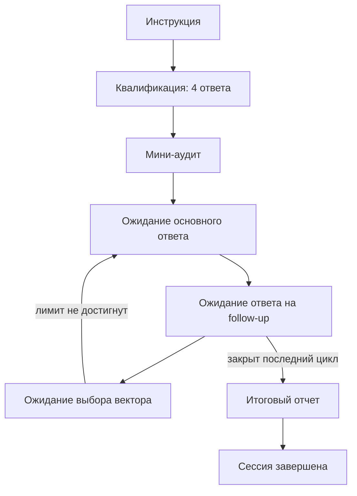

# Рабочий сценарий минимальной версии

Этот файл описывает текущую рабочую интерпретацию логики заказчика для реализации.
Исходный файл `Workflow-by-DanyaClaude.md` остаётся неизменным.

## Фаза 0. Инструкция

Бот один раз объясняет порядок интервью: короткая квалификация, мини-аудит,
технические вопросы, уточнения и обратная связь.

После инструкции бот сразу спрашивает грейд кандидата.

## Фаза 1. Квалификация

Квалификация управляется кодом, а не моделью. Бот задаёт четыре вопроса строго по
порядку и сохраняет каждый ответ сразу после получения:

1. Грейд: джун, мидл или сеньор. Ответ выбирается кнопкой.
2. Направление и индустрия основного опыта или цели.
3. Задачи, в которых есть реальный опыт, и задачи, в которых опыта почти нет.
4. Конкретная вакансия или дата собеседования, если они есть.

Модель не определяет, заполнено ли поле, и не генерирует следующий вопрос. Поэтому
бот не может повторно спрашивать грейд из-за отсутствующей технической метки.

После четвёртого ответа бот автоматически переходит к мини-аудиту. Дополнительное
сообщение пользователя для перехода не требуется.

## Фаза 2. Мини-аудит

Модель получает все четыре сохранённых ответа квалификации одним явным контекстом.
Она формирует 2–4 гипотезы слабых зон и возвращает их в рамке `МИНИ-АУДИТ`.

После мини-аудита бот автоматически выбирает и отправляет первый вопрос из банка.

## Фаза 3. Цикл вопросов

Минимальный целевой цикл:

1. Бот отправляет основной вопрос из банка.
2. Кандидат отвечает.
3. Модель даёт короткую обратную связь, бот задаёт уточняющий вопрос.
4. Кандидат отвечает на уточнение.
5. Модель разбирает оба ответа, обновляет карту слабых мест и предлагает направления
   следующего цикла.
6. Кандидат выбирает направление, после чего начинается новый цикл.

Каждый цикл сохраняется в `question_attempts`. Там лежат оба ответа, обе обратные
связи, уточняющий вопрос и выбранное направление. После полной обратной связи бот
показывает конкретные кнопки: углубиться в текущую тему, перейти к другой слабой зоне
или взять случайную тему. Уже использованный основной вопрос в этой сессии повторно
не выбирается.

Тема вопроса сохраняется в карте слабых мест как `confirmed`, если пробел остался,
или `closed`, если кандидат исправился после уточнения.

## Временное завершение сессии

Пока заказчик не определил отдельный способ завершения, действует существующий
`SESSION_CYCLE_LIMIT`. По умолчанию это 8 полных циклов. После последнего уточняющего
ответа итоговый отчёт строится из сохранённых попыток и карты слабых мест.

## Карта состояний

Внутри общей фазы `QUESTION_CYCLE` реальные подсостояния хранятся в `question_attempts.status`:
`WAITING_PRIMARY`, `PRIMARY_FEEDBACK_READY`, `WAITING_FOLLOWUP`, `FINAL_FEEDBACK_READY` и `WAITING_VECTOR`.
Состояния `*_READY` нужны для повторной доставки уже сохранённой обратной связи после сетевой ошибки.

## Что переживает перезапуск

PostgreSQL хранит фазу сессии, четыре ответа квалификации, текущий вопрос, оба ответа
цикла, обе обратные связи, выбранный вектор, карту слабых зон и итоговый текст. После
перезапуска очередное сообщение студента продолжает сохранённый шаг. Если summary уже сохранён,
он отправляется повторно без нового LLM-вызова.

## Как выбирается вопрос

1. Берётся явно выбранная кандидатом тема. Если выбран случайный вопрос, фильтр темы пропускается.
2. Без явного выбора берётся первая незакрытая зона, затем первая тема из мини-аудита.
3. Выбирается случайный ещё не использованный вопрос из явной матрицы совместимых грейдов.
4. Если в узкой теме вопросов не осталось, выбор повторяется без фильтра темы.

`SESSION_CYCLE_LIMIT` считает только полные циклы. Основной ответ без ответа на follow-up не увеличивает счётчик.
